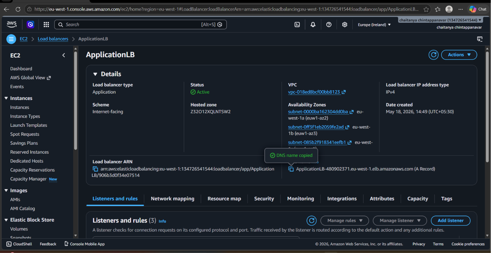
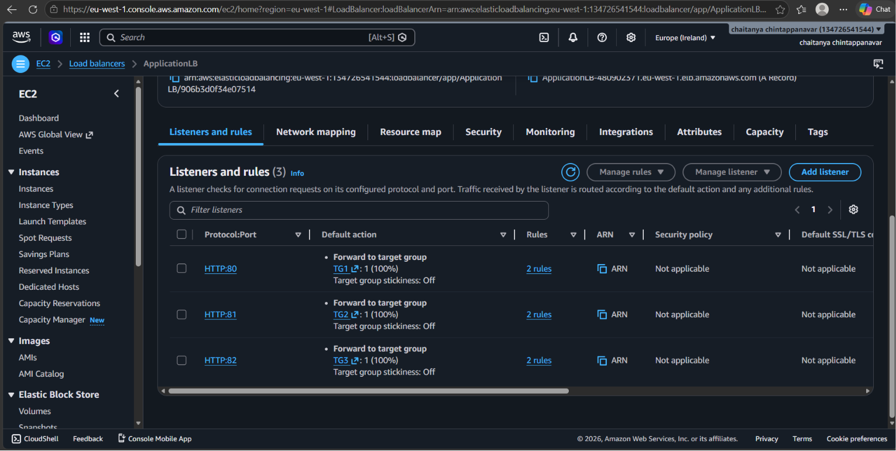
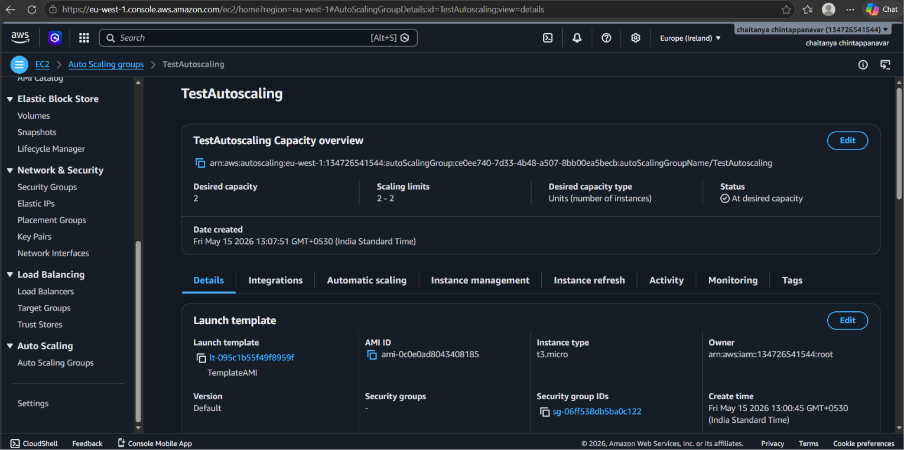
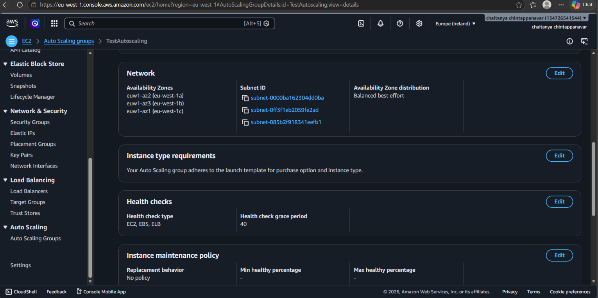
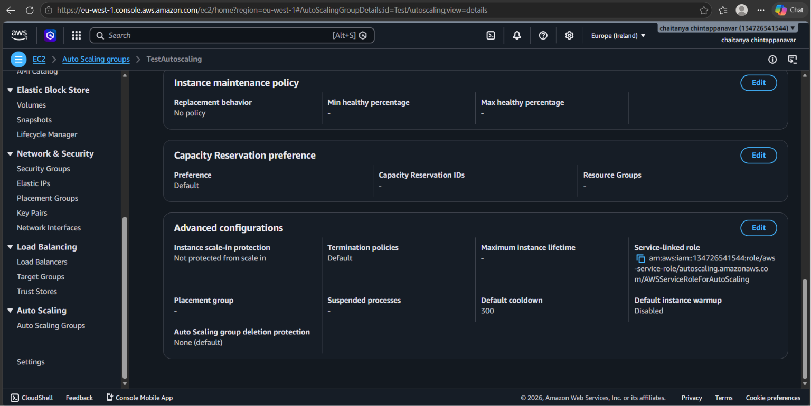
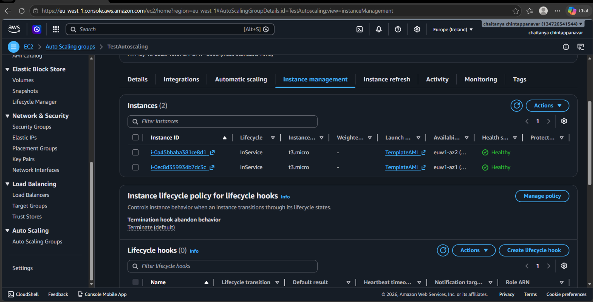
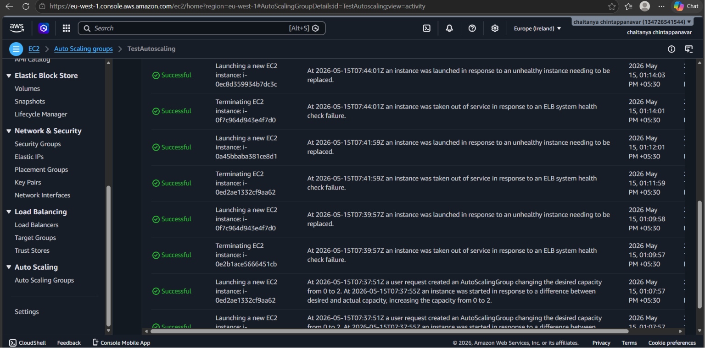
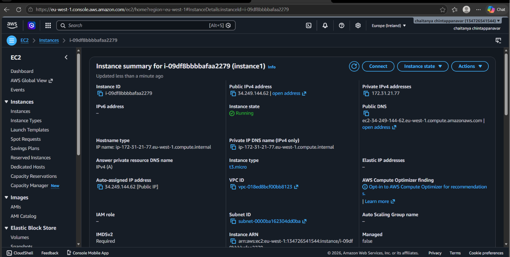
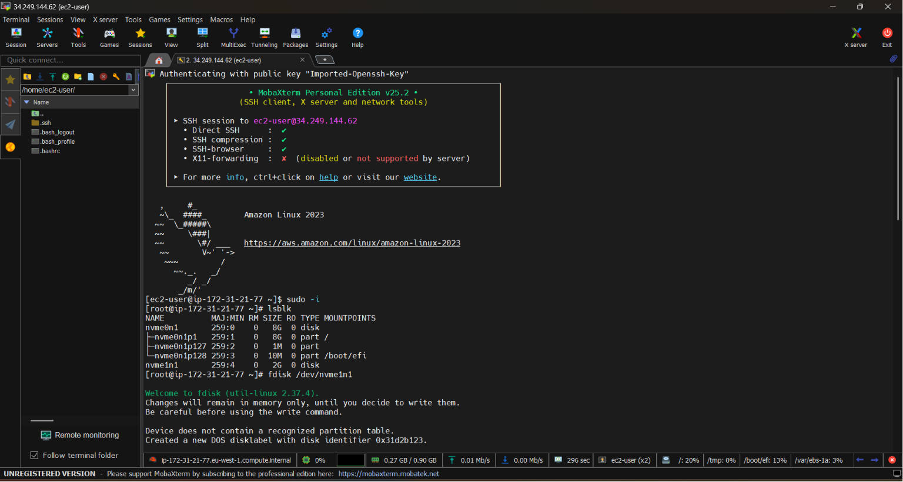
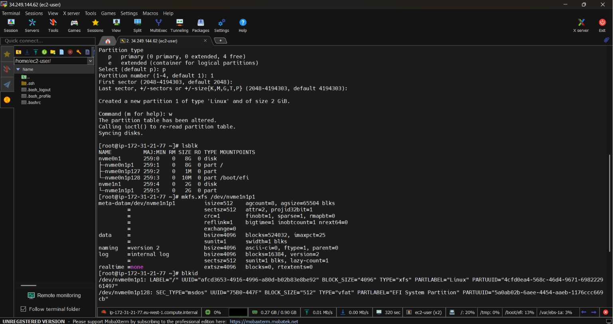

# AWS High-Availability & Elastic Compute Infrastructure Blueprint

This repository showcases a professional portfolio of advanced AWS cloud infrastructure automation, horizontal auto-scaling fleet mechanics, and Layer 7 traffic routing metrics managed via Infrastructure as Code (IaC).

---

## 🚀 Project 1: [Application-Load-Balancer](./application-load-balancer.yaml)
*(Click title for production CloudFormation template)*

**Goal:** Establish a resilient, public-facing Layer 7 routing layer across multi-AZ public networks to eliminate ingress single-point-of-failure vectors.

### Project Screenshots:

---

## ⚖️ Project 2: [Compute-Auto-Scaling](./compute-asg.yaml)
*(Click title for production CloudFormation template)*

**Goal:** Provision a self-healing, multi-AZ t3.micro EC2 compute fleet that dynamically maintains instance availability and automates rolling application updates.

### Project Screenshots:

---

## 💽 Project 3: [Linux-Block-Storage-Administration](./linux-block-storage-administration)
*(Click title for automated EBS initialization shell script)*

**Goal:** Attach, initialize, and map raw secondary AWS EBS block volumes dynamically using system sector layouts formatted under the XFS journaling filesystem.

### Project Screenshots:

---

## 🛠️ Tech Stack
* **Cloud Infrastructure & IaC:** AWS CloudFormation, EC2, Systems Manager (SSM) Parameter Store, Application Load Balancers
* **Linux Systems Administration:** Bootstrapping Systems Execution (UserData), Bash Shell scripting, XFS System Layout Utilities
* **Core Competencies:** Decoupled Cloud Architecture Design, Cross-Stack Reference Binding (`!ImportValue`), Multi-AZ High-Availability Failovers

---

## 👤 Author
**Chaitanya Chintappanavar** — *DevOps Cloud & Linux Infrastructure Engineer*
